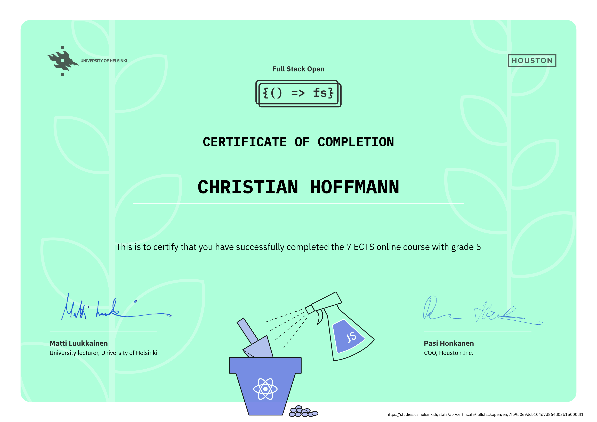

# Full Stack Open 🚀

This repository contains my solutions and assignments for the [Full Stack Open](https://fullstackopen.com/en/) course by the University of Helsinki.

## Skills & Technologies 💻

The course covers modern full-stack JavaScript development — from building component-based UIs with React and custom hooks to implementing REST APIs with Node.js and Express, managing application state with Redux and React Query, working with MongoDB, and writing automated tests from unit to end-to-end level.

| Category             | Technologies                                                                            |
| -------------------- | --------------------------------------------------------------------------------------- |
| **Frontend**         | React, React Router, Vite, Axios, Tailwind CSS                                          |
| **State Management** | Redux, Redux Toolkit, TanStack React Query                                              |
| **Backend**          | Node.js, Express, REST API design                                                       |
| **Database**         | MongoDB, Mongoose                                                                       |
| **Authentication**   | JWT, bcrypt                                                                             |
| **Testing**          | Vitest, React Testing Library, Supertest, Playwright (E2E)                              |
| **Key Concepts**     | Client-side routing, user authentication, test-driven development, CI-ready test suites |
| **Tooling**          | ESLint, json-server, npm Workspaces                                                     |

## Certificate 🎓

**[Verify certificate at the University of Helsinki](https://studies.cs.helsinki.fi/stats/api/certificate/fullstackopen/en/7fb950e9dcb104d7d864d03b15000df1)**

## Contents by Parts 📚

- **[Part 0](./0_web-fundamentals/)** – Fundamentals of web apps
- **[Part 1](./1_react-intro/)** – Introduction to React
- **[Part 2](./2_server-communication/)** – Communicating with the server
- **[Part 3](./3_nodejs-express/)** – Programming a server with Node.js and Express
- **[Part 4](./4_backend-testing/)** – Testing Express servers, user administration
- **[Part 5](./5_frontend-testing/)** – Testing React apps
- **[Part 6](./6_state-management/)** – Advanced state management
- **[Part 7](./7_advanced-react/)** – React router, custom hooks, styling apps with CSS and Webpack
